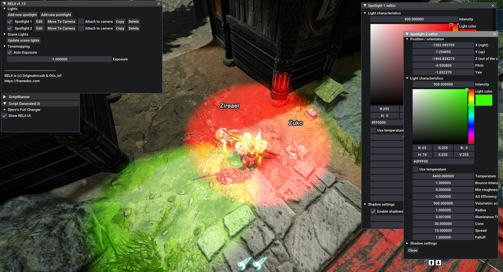

# RELit

---

**NOTE**: You're not allowed to re-host this mod anywhere else, be it Nexus or your own site or on some discord or whatever else you can come up with. 

RELit is a powerful tool to create spotlight and pointlights in RE powered games. Please read the requirements and how to install it.

RELit was written by [Originalnicodr](https://github.com/originalnicodr) and [Otis_inf](https://github.com/FransBouma).

Special thanks go to [alphaZomega](https://github.com/alphazolam) for the assistance and [praydog](https://github.com/praydog) for REFramework.

At the time of writing the supported games are *Devil May Cry 5*, *Monster Hunter Rise*, *Resident Evil 2 Remake*, *Resident Evil 3 Remake*, *Resident Evil 7* and *Resident Evil Village*, *Resident Evil 4*, *Dragon's Dogma 2*, and *Monster Hunter Wilds*. But we would expect future Capcom games that run on the RE Engine and are supported by REFramework to work as well.

## Requirements
RELit depends on the REFramework by praydog. You need to download the REFramework version for your game, [here](https://github.com/praydog/REFramework-nightly/releases) (currently using the nightly builds, for a stable version go [here](https://github.com/praydog/REFramework/releases)). Go to the latest release and then click the .zip file for the game you want to use RELit with. 
For more information about REFramework, visit [the project repository](https://github.com/praydog/REFramework).

## Installation
Please visit the [Releases](https://github.com/originalnicodr/RELit/releases) to get the latest release. 

After downloading the REFramework zip for your game, unpack that zip into a folder. Then copy *only* the `dinput8.dll` file and place
it in the game's folder, where the exe is. So e.g. in the case of DMC5, you download the DMC5.zip from the REFramework releases, 
unpack it into a folder, and then copy the `dinput8.dll` file to the DMC5 game folder, which is `<steam folder>\common\Devil May Cry 5`

After you've installed the REFramework dll (the `dinput8.dll`), you can install the RELit mod into the game folder. 
Simply copy the reframework folder from the RELit zip into the game's folder (the same one into which you placed the `dinput8.dll`).

## Configuring RELit and REFramework
The default key to open the REFramework gui is the `Insert` key. If you use the Otis_Inf cameras you'd like to rebind this key in REFramework
to another key, e.g. scroll lock. When the REFramework GUI is open, go to configuration and rebind the menu key there, by clicking `Menu key`
and then press the key you want to use, e.g. scroll lock, to open the REFramework gui.

When the REFramework GUI is open, click on `Script Generated UI`, and you'll see the `Show RELit UI` checkbox. Checking it will open the 
RELit window. It has an initial width and height, you can resize it which will be remembered for the next sessions.

After you've opened the RELit GUI, you can create lights, manage scene lights and use the tonemapper features.

## Creating lights
In the RELit GUI, click open `Lights` to create custom lights. To create a light, click on the `Add new spotlight` or `Add new pointlight` buttons to create 
a light of that type. The light is created at the position of the camera. To edit light characteristics, click on the `Edit` button next to the light in the 
list of lights, which appears after creating a light. To delete a light, click on the `Delete` button.

You can also disable the light by clicking the checkbox next to its name.

The lights can also be moved to the camera position again by clicking `Move to camera`, or be tied to the camera by checking the `Attach to camera` checkbox.

You can also copy a light's property into another light by clicking the `Copy` button.

## Managing scene lights
When you click to open the `Scene Lights` header, you can obtain the current scene lights by clicking the `Update scene lights` button. After you've done that
you can switch the currently switched on lights off with the new `Switch off scene lights` button. After you've done that you have to switch the lights
back on with the `Switch scene lights back on` button before you can obtain the scene lights again. 

Do take in mind that, at least the way we manage to make this work for now, if you turn off the lights and turn them on again, their intensity will increase.

Also, not all emitting lights are lights we can control. So the elements that are left that emit lights are elements that are other elements than lights and we can't control them being switched on/off, sadly.

## Tonemapping
To work with lights in a more consistent way you can turn off the Auto exposure and edit it yourself by going to the `Tonemapping` section in RELit and using the relevant setting there.

# **Documentation**

For detailed information about the function of each light parameter and visual comparisons using sliders when modifying them, please refer to [the guide available on the framed site](https://framedsc.com/GeneralGuides/relit.htm#documentation).
